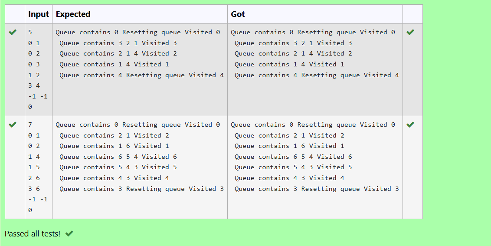

# Ex22 Breadth First Graph
## DATE:
## AIM:
To write a printQueue C function of the given graph that is to be traversed in the breadth first manner.


## Algorithm
1. Read integer V and initialize adjacency matrix with zeros.
2. Calculate max edges me = V * (V - 1).
3. Loop i = 1 to me, read e1 and e2; if e1 == -1 and e2 == -1, break.
4. Add edge (e1, e2) to adjacency matrix.
5. Print the adjacency matrix.  

## Program:
```

Program to traverse graph using BFS
Developed by: D VERGIN JENIFER
RegisterNumber: 212223240174
/*#include <stdio.h>
#include <stdlib.h>
#define SIZE 40
 
struct queue {
  int items[SIZE];
  int front;
  int rear;
};
 
struct queue* createQueue();
void enqueue(struct queue* q, int);
int dequeue(struct queue* q);
void display(struct queue* q);
int isEmpty(struct queue* q);
void printQueue(struct queue* q);
 
struct node {
  int vertex;
  struct node* next;
};
 
struct node* createNode(int);
 
struct Graph {
  int numVertices;
  struct node** adjLists;
  int* visited;
};*/
void printQueue(struct queue* q) {
    int i;
    if(isEmpty(q)){
        printf("Queue is empty");
    }
    else{
        printf("Queue contains ");
        for(i=q->front;i<q->rear+1;i++){
            printf("%d ",q->items[i]);
        }
    }
}

```

## Output:



## Result:
Thus, the code for the printQueue function of the following graph that is to be traversed in the breadth first manner is implemented successfully.
