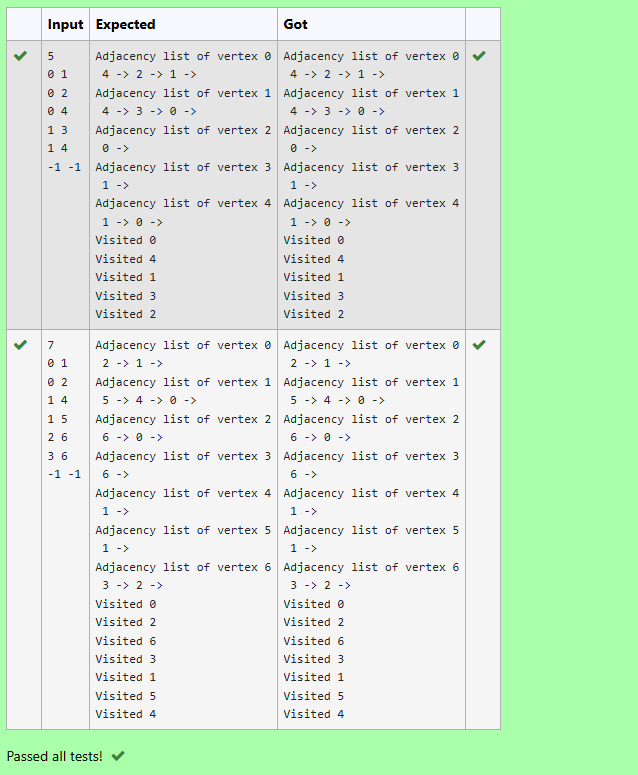

# Ex23 Depth First Graph
## DATE:
## AIM:
To compose the code for the function createNode to traverse the graph below in the depth first fashion.


## Algorithm
1. Define a struct node with an integer vertex and a pointer to the next node.
2. Create a function createNode that takes an integer v.
3. Allocate memory for a new node.
4. Set the node’s vertex value to v and next pointer to NULL.
5. Return the pointer to the new node.

## Program:
```

Program to createNode to traverse the graph below in the depth first fashion.
Developed by: D VERGIN JENIFER
RegisterNumber: 212223240174
/*#include <stdio.h>
#include <stdlib.h>

struct node {
  int vertex;
  struct node* next;
};

struct node* createNode(int v);

struct Graph {
  int numVertices;
  int* visited;

  // We need int** to store a two dimensional array.
  // Similary, we need struct node** to store an array of Linked lists
  struct node** adjLists;
};*/
struct node* createNode(int v) {
    struct node* newNode=malloc(sizeof(struct node));
    newNode->vertex=v;
    newNode->next=NULL;
    return newNode;
}


```

## Output:



## Result:
Thus, the C code for the function createNode to traverse the graph below in the depth first fashion is implemented successfully
