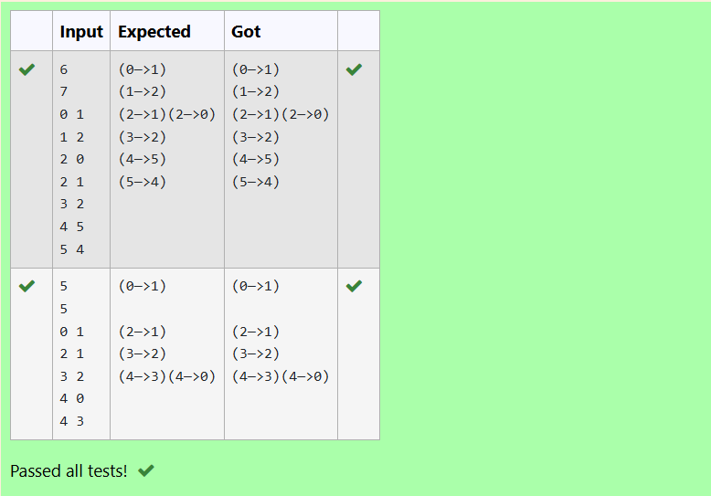

# Ex25 Adjacency List Representation
## DATE:
## AIM:
To write a C program to represent the given graph using the adjacency list.

## Algorithm
1. Read the number of vertices (N) and number of edges (n) from input.
2. Create an array of edges and read source and destination for each edge.
3. Build the graph using the createGraph() function with the edge array.
4. Display the adjacency list of the graph using printGraph().
5. Exit the program.  

## Program:
```

Program to represent the given graph using the adjacency list.
Developed by: D VERGIN JENIFER
RegisterNumber: 212223240174

/*#include <stdio.h>
#include <stdlib.h>
 
// Define the maximum number of vertices in the graph
int N; 
 
// Data structure to store a graph object
struct Graph
{
    // An array of pointers to Node to represent an adjacency list
    struct Node* head[10];
};
 
// Data structure to store adjacency list nodes of the graph
struct Node
{
    int dest;
    struct Node* next;
};
 
// Data structure to store a graph edge
struct Edge {
    int src, dest;
   
} *edges[50];
*/
int main(void)
{   
    int n;
    scanf("%d",&N);
    scanf("%d",&n);
    struct Edge edges[n];
    for(int i=0;i<n;i++){
        scanf("%d",&edges[i].src);
        scanf("%d",&edges[i].dest);
    }
    struct Graph* graph=createGraph(edges,n);
    printGraph(graph);
    return 0;
}


```

## Output:



## Result:
Thus, the C program to represent the given graph using the adjacency list is implemented successfully
